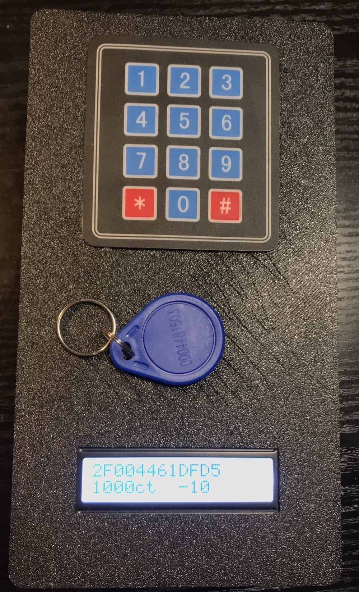
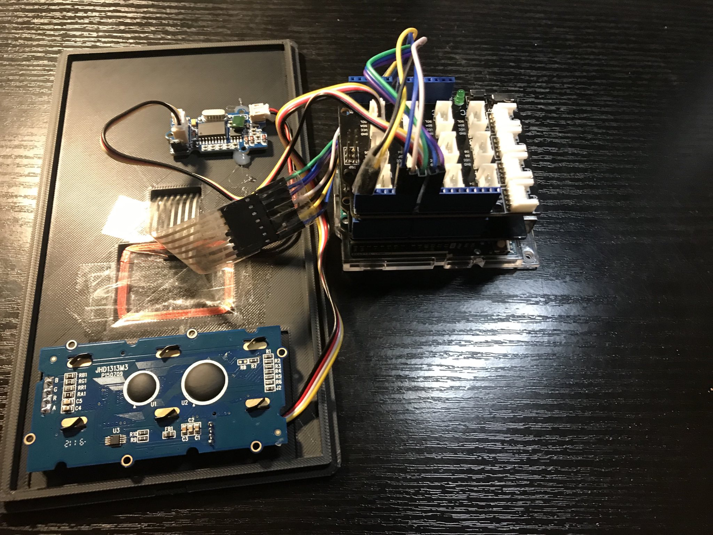

# cafeteria payment system
a easy way to implement cachless payment into small shops like a cafetiria in school using RFID chips

	

## fetures
- [x] saves money using acounts on device
- [x] saves data on SD-card, to stay the same after unplugin from power

## technical setup

- Arduino Uno
- RFID reader
- keypad
- alphanumeric LCD display
- sd card shield 

## warning:
- because of the RAM lemitations of the Arduino it can handle just a few users.
